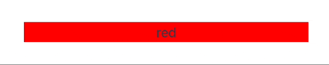
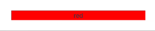

# @hoqn/motioned-react

> [!IMPORTANT]
> 이 라이브러리는, 주로 학습을 목적으로 직접 구현해 본 라이브러리예요. 실제 프로젝트나 서비스에는 절대! 사용하지 마세요.  
> framer-motion을 사용하실 수 있어요.

React에서 사용할 수 있는 애니메이션 라이브러리예요. framer-motion의 사용법과 형태를 거의 그대로 따라요. 대신, `requestAnimationFrame`을 내부적으로 사용하는 framer-motion과 달리 Web Animations API을 사용했다는 점이 달라요.

#### 특징

- Web Animations API를 기반으로 동작해요. 따라서 JS 엔진의 작업이 많아질 때도 끊김 없는 애니메이션을 기대할 수 있어요.

- framer-motion의 `motion`과 비슷한 `motioned` 인터페이스를 가지고 있어요.  
단, 내부적인 애니메이션 값은 Web Animations API의 키프레임 구조를 그대로 따라요.

```tsx
const MotionedComponent = motioned(MyComponent);

<MotionedComponent 
  initial={{ opacity: 0 }}
  animate={{ opacity: 1, options: { duration: 1000 } }}
  exit={{ opacity: 0, options: { duration: 1000 } }} />
<motioned.div animate={{ opacity: isShown ? 1 : 0 }}>Hello</motioned.div>
```

- framer-motion의 `AnimatePresence`와 비슷한 `AnimatePresence` 인터페이스를 가지고 있어요.

```tsx
<AnimatePresence mode="wait">
  {isShown && (
    <motioned.div 
      key="1"
      initial={{ opacity: 0 }}
      animate={{ opacity: 1, options: { duration: 1000 } }}
      exit={{ opacity: 0, options: { duration: 1000 } }} >
      Hello World
    </motioned.div>
  )}
</AnimatePresence>
```

- TypeScript를 지원해요. 타입이 작성되어 있고, MotionedComponent의 `initial`, `animate` 같은 프롭에 대한 타입도 제공해요.

## 사용법

### `motioned`

`motioned(Component)`의 형태로, 컴포넌트를 감싸면 `@hoqn/motioned-react`에 통제되는 MotionedComponent를 반환해요.

일반적인 HTML 태그들의 경우 `motioned.div`와 같은 형태로 미리 선언되어 있어요.

MotionedComponent는 몇 가지 추가적인 프롭을 가지게 돼요.

- `initial`: 최초에 렌더링될 때 실행될 애니메이션을 기술해요.
- `animate`: 동적으로 실행될 애니메이션을 기술해요.
- `exit`: 해당 컴포넌트가 화면에서 사라질 때, DOM 자체를 제거하기 전 실행할 애니메이션을 기술해요. 상위에 `AnimatePresence` 컴포넌트가 필요해요.

> [!NOTE]
> 실제 DOM 노드에 접근해야 하기 때문에, 컴포넌트를 감싸는 경우 `forwardRef`를 비롯한 방법으로 `ref`를 전달받을 수 있도록 해야 원활히 작동할 수 있어요.

```tsx
const MotionedMyComponent = motioned(MyComponent);

const MyComponent = forwardRef(function ({ className }, ref) {
  return <div className={className} ref={ref}>Hello World</div>
});
MyComponent.displayName = 'MyComponent';
```

애니메이션은 다음과 같이 기술할 수 있어요.

```tsx
<MotionedMyComponent 
  initial={{ opacity: 0 }}
  animate={{ opacity: 1, options: { duration: 1000 } }}
  exit={{ opacity: 0, options: { duration: 1000 } }} />
```

### `AnimatePresence`

하위 자식 요소들에 대해 삭제되는 동작을 추적할 수 있게 해주는 컴포넌트에요. 이 컴포넌트 하위의 MotionedComponent는 리액트 상에서 언마운트되어도 실제 DOM에서 바로 제거되지 않고 `exit` 애니메이션을 마친 뒤 제거돼요.

> [!NOTE]
> `AnimatePresence`는 자식 요소들 사이에서 `key`를 기반으로 그 변화를 추적해요. 따라서, 적절한 `key`를 입력해주셔야 정상적으로 작동해요.

```tsx
<AnimatePresence mode="wait">
  {color && (
    <motioned.div 
      key={color}
      initial={{ opacity: 0 }}
      animate={{ opacity: 1, backgroundColor: color, options: { duration: 1000 } }}
      exit={{ opacity: 0, options: { duration: 1000 } }} >
      Hello World
    </motioned.div>
  )}
</AnimatePresence>
```

`mode`는 총 두 가지가 있어요. (`popLayout`은 아직 구현되지 않았어요)

- `mode="sync"`: 기본값이에요. 모든 변화를 한 번에 트리거시켜요. 예컨대, A가 B로 교체되는 경우, A의 `exit` 애니메이션과 B의 `animate`가 동시에 동작해요.  

- `mode="wait"`: `exit` 애니메이션들이 모두 끝날 때까지 기다린 후 `animate` 애니메이션을 동작시켜요. 예컨대, A가 B로 교체되는 경우, A의 `exit` 애니메이션과 B의 `animate`가 순차적으로 동작해요.  


#### 해결되지 않은 문제

- `AnimatePresence`에서 `popLayout` 모드는 지원하지 않아요.

- `layoutId`에 기반한 Shared Element Animations을 지원하지 않아요.

- Layout Animations을 지원하지 않아요.
